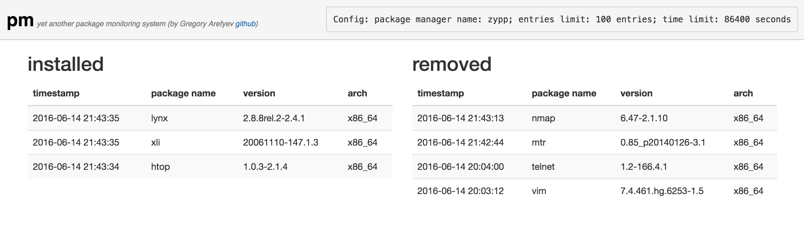

Package monitoring
==================

A simple web application that allows to watch what happens to the packages in the system
in a real time. Whether the package is installed or removed it will be shown on the dashboard.



The general disign decision is to build monitoring system relying on package manager's
history log file.

Advantages of this approach:
- relatively cheap access to exactly the latest actions undertaken by package manager
- distinct simplicity of implementation without involving of any ornate prerequisites

Disadvantages:
- history logs are not guaranteed to be present or to be opened for reading
- once occurred log rotation may bring a bit of confusion on what's happening
- from one package manager to another the format of log file may differ dramatically

What's under the hoods:
- efficient log file entry searcher module with Fibonacci search technique implementation that allows to
perform search of a particular entry in the log file producing relatively few interaction with the filesystem
- a simple yet efficient FIFO queue implementation that allows to keep most recent entries cached and accessible in
exactly same order as they come
- a tiny package manager's log driver framework that allows to easily create a variety of drivers by implemeting
of just two mandatory methods concerned with log file parsing
- websocket based client application
- complete verbose documentation of almost each line of code

Trade-offs of current version:
- only zypp package manager is currently supported
- absolutely non-interactive web-client application
- actions taken by package manager other than install or remove are currently not displayed on the dashboard

So here we go, three steps to check it out on openSUSE box:
```
curl https://raw.githubusercontent.com/grinya007/pm/master/Dockerfile --output Dockerfile
docker build -t grinya007/pm .
docker run -dit -p 3000:3000 -v /var/log/zypp:/zypp -e PM_LOG=/zypp/history grinya007/pm
```
